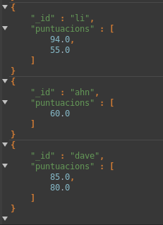
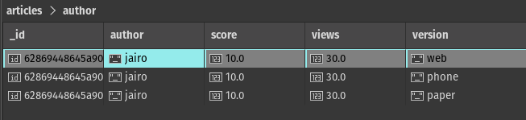

# Aggregate 

Provarem les diferents comandes (pipelines)  a partir de la inserció d'aquests registres de prova: 

> db.articles.insertMany([
{ "author" : "dave", "score" : 80, "views" : 100 },
{ "author" : "dave", "score" : 85, "views" : 521 },
{ "author" : "ahn", "score" : 60, "views" : 1000 },
{ "author" : "li", "score" : 55, "views" : 5000 },
{ "author" : "annT", "score" : 60, "views" : 50 },
{ "author" : "li", "score" : 94, "views" : 999 },
{ "author" : "ty", "score" : 95, "views" : 1000}, { "author" : "dave", "score" : 70, "views" : 1100 },
{ "author" : "dave", "score" : 95, "views" : 1521 },
{ "author" : "ahn", "score" : 60, "views" :2000 },
{ "author" : "li", "score" : 35, "views" : 6000 },
{ "author" : "annT", "score" : 65, "views" : 1050 },
{ "author" : "li", "score" : 96, "views" : 1999 },
{ "author" : "ty", "score" : 89, "views" : 2000 }]);

La instrucció aggregate, es una concatenació de diferents pipelines, que van modificant la consulta a partir del pipeline anterior.

#### Diferents Pipelines 
[Link a la documentació oficial de mongodb](https://www.mongodb.com/docs/v4.2/reference/operator/aggregation-pipeline/#aggregation-pipeline-operator-reference "Link documentació")

##### MATCH

Realitza la funció de where i funciona molt similar a la instrucció **find** de mongodb

>db.articles.aggregate(
    { $match : { author : "dave" } } ]
);

aquesta instrucció serviria per seleccionar tots els registres al qual el seu autor és David.

Tots els operadors vistos amb el find funcionen igual. *Exemple: *

> db.articles.aggregate( [
  { $match: { $or: [ { score: { $gt: 70, $lt: 90 } }, { views: { $gte: 1000 } } ] } }
] );

En aquest cas, seleccionem els articles que el score es troben entre 70 i 90, o el camp views es més gran o superior a 1000.

##### GROUP
[link documentació](https://www.mongodb.com/docs/v4.2/reference/operator/aggregation/group/#pipe._S_group "link")
Sería la funció similar a la de sql (*GROUP BY*)

> db.articles.aggregate( [
  { $match: { $or: [ { score: { $gt: 70, $lt: 90 } }, { views: { $gte: 1000 } } ] } },
  { $group: { _id: null, count: { $sum: 1 } } }
] );

El camp que fica _id, son els camps pels qual agrupa els registres, en aquest cas al ficar **null**, agafa tots els registres i realitza un count.

>db.articles2.aggregate([
   { $match: { score: {$gt:35} } },
   { $group: { _id: "$author", total: { $sum: "$views" } } }
])

En aquest cas despres de eliminar tots els registres que tenen puntuació menor de 35, agrupem per autor i fer la suma de visites que han vist el seu article, que es mostraran en un camp total.

Totes les funcions que podem utilitzar al pipeline group, es pot consultar [aqui](https://www.mongodb.com/docs/v4.2/reference/operator/aggregation/group/#accumulators-group "aqui"), moltes son similars a funcions existents en sql, però una de les més interessants i diferent a sql, seria el $addToSet, que agafa tots els valors diferents  d'un camp per una  agrupació i els fica tots en un array.

>db.articles.aggregate(
   [
     {
       $group:
         { _id: "$author",
           puntuacions: { $addToSet: "$score" }
         }
     }
   ]
)

##### PROJECT
Seria el equivalent al select camp1,camp2,camp3, de sql, amb la diferencia, que a partir del pipeline project, tots els camps no indicats amb 1, desapareixen per les següents etapes
[documentació aquí](https://www.mongodb.com/docs/v4.2/reference/operator/aggregation/project/#pipe._S_project "documentació aquí")

>db.articles.aggregate(
   [
     { $sort : { score : -1, views: 1 } }
   ]
)

aquest cas ordenariem, pels articles mes valorats, i en cas d'empat ordena per les que tenen més visites primers.

>db.articles2.aggregate([
   { $match: { score: {$gt:35} } },
   { $project: { _id: 0, "author":1, score:1 } }
])

Aquest instrucció mostraria els camps author i el score, els altres no els mostraria. Per defecte tots els camps estan marcats a 0 (no es projecten) excepte el _id, que per defecte es troba a 1 i si no volen que es marqui, s'ha de ficar a 0

##### SORT
Ordena la collection pels camps indicats en aquest pipeline. Els camps marcats amb *1*  s'ordenaran de forma ascendent, i amb *-1* descendent
[documentació aqui](https://www.mongodb.com/docs/v4.2/reference/operator/aggregation/sort/#pipe._S_sort "documentació aqui")

##### SKIP

Salta els 5 primers registres que troba

> db.article.aggregate([
    { $skip : 5 }
]);

##### LIMIT

Mostra els registres indicats al pipeline limit 

> db.article.aggregate([
   { $limit : 5 }
]);

##### UNWIND

Descomposa, si en un registre existeix un camp amb valors arrays , els pots descomposar.

Suposem que tenim aquest registre a articles 

>  db.articles.insert(
{ "author" : "jairo", "score" : 10, "views" : 30 , "version":["web","phone","paper"]})

aquest registre mostraria un artícle, publicat amb 3 versions, via web, via mòvil i versiò escrita.

>db.articles.aggregate( [ { $unwind : "$version" } ] )

Hi ha mes opcions interessants que es poden fer amb el pipeline unwind, que es poden trobar a la [documentació oficial](https://www.mongodb.com/docs/v4.2/reference/operator/aggregation/unwind/#pipe._S_unwind "documentació oficial")

##### OUT
Comanda per agafar el resultat final e insertarlo a una nova collection, indicada en aquest pipeline.
[documentació aquí](https://www.mongodb.com/docs/v4.2/reference/operator/aggregation/out/#pipe._S_out)

Amb SQL, seria com si fessis un SELECT, i el resultat que et dones aquell select, realitzessis un INSERT INTO

> db.articles..aggregate({out:"backup"})

##### MERGE

Es una evolució del out, crea nous registres en una nova collection o si existeix els inserta, o fins i tot pots indicar que els actualitzi, en cas que coincideixi cert camp.

>db.articles..aggregate({ $merge: { into: "articles2", on: "_id", whenMatched: "replace", whenNotMatched: "insert" } })

En aquest cas insertaria a una nova collection, si aquesta collection ja existeix, i ja hi es amb aquella id, realitzaria un update, sinò faria un insert.
**Sol funciona a partir de la versió 4.2 de mongodb**

##### SET

Afegeixes nous camps a un registre o a tots els registres específicats.

>db.articles..aggregate( {
     $set: {
        ViewmoreTotal: { $add: [ "$score", "$views" ] }
     }
   })

En aquest cas a tots els registres, els hi afegiria un nou camp, **ViewmoreTotal** , amb la suma dels valors dels camps *views* i *score*
**Sol funciona a partir de la versió 4.2 de mongodb**
